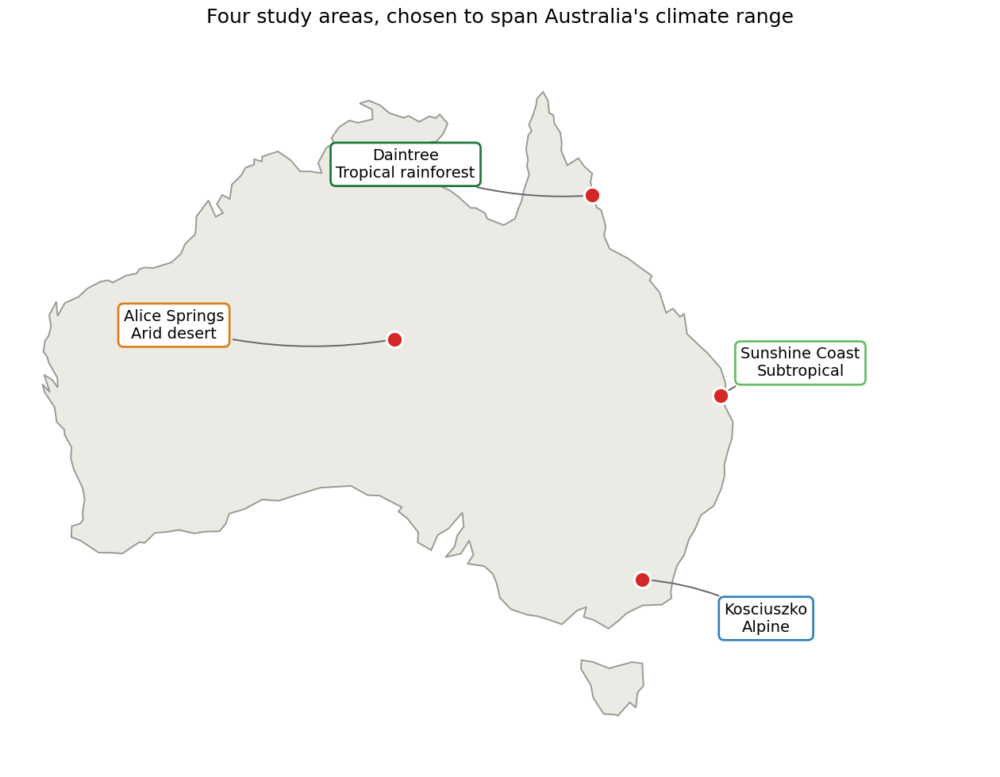
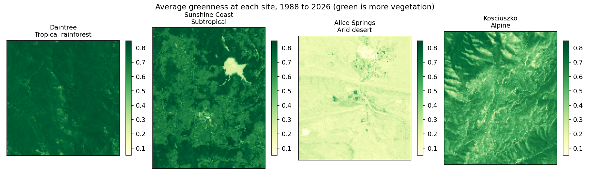
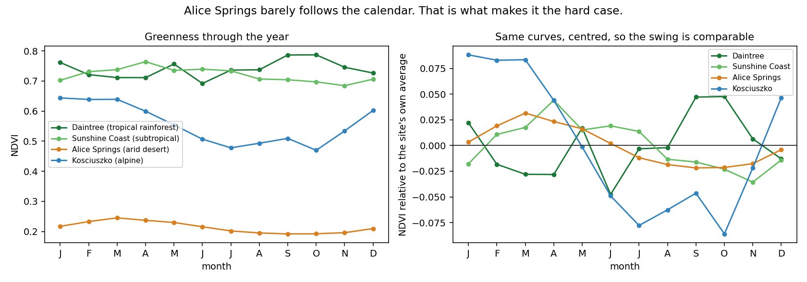
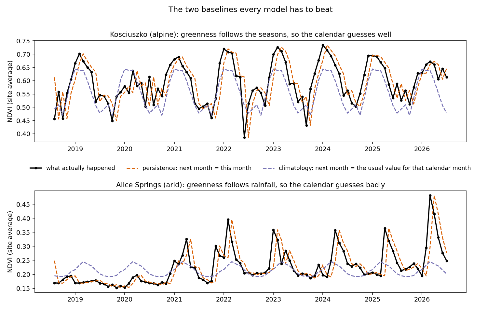
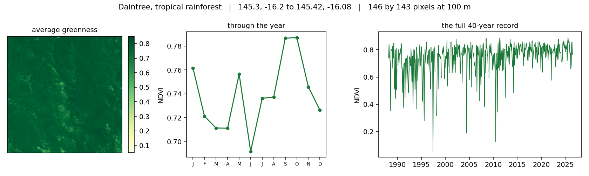
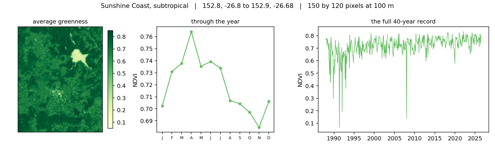
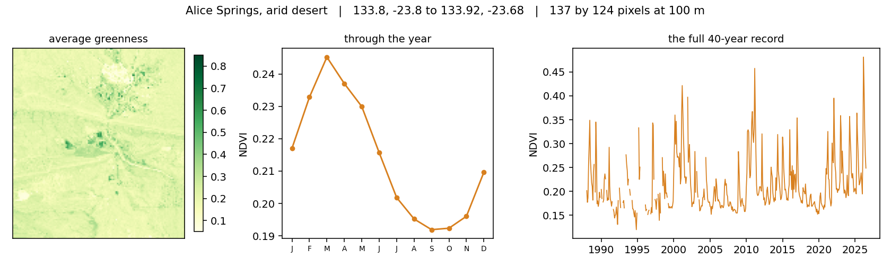
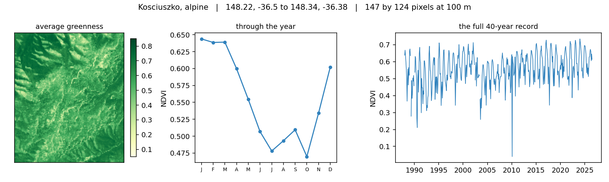

# Ecosystem State Forecaster


**[Try the interactive demo](https://ecosystem-state-forecaster.streamlit.app)**

## Introduction

Satellites photograph the whole of Australia every few days. From those images
you can measure how green the land is, and greenness is a good proxy for how much
vegetation is growing. Track it month by month and you can see droughts arrive,
crops develop, deserts bloom after rain, and alpine country brown off for winter.

This project asks one question: can a machine learning approach be used to predict
next month's greenness better than either:

1. Assuming nothing changes, and next month looks like this month; or,
2. Assuming this month is typical, and next month looks like an average October,
   an average March, and so on.

Both assumptions are almost free to compute, and both are surprisingly hard to beat and
I wanted to create a model that beats them on data it has never seen.
Most of the effort in this project went into making a model that has learnt,
rather than just building a model that has just memorised the seasons.

Overall, tl;dr is that model performance depends on where you are and how much history you
have, however the manner in which it depends is the interesting part.

### What I found

- In green, seasonal country, predicting next month by only using the seasonal averages
  is very hard to beat. Over an 11-year record, the models matched the seasonal average
  but did not pass it.
- In the desert, the seasonal averages are close to useless, because desert plants respond
  to rainfall rather than to the time of year. There the models won clearly.
- However, extending the record from 11 years to 40 reversed the headline. With four
  decades of history the models beat the seasonal average across all tested biomes, partly
  because they had more to learn from and partly because the seasonal average
  itself gets weaker the more years you ask it to summarise.
- Using sharper 10 m imagery instead of 100 m did not help improve model performance.

### Contents


- [Key terms](#key-terms)
- [Aims](#aims)
- [Study areas](#study-areas)
- [The data](#the-data)
- [The models](#the-models)
- [Model evaluation](#model-evaluation)
- [Results](#results)
- [Interactive demo](#interactive-demo)
- [Running it yourself](#running-it-yourself)
- [Appendices](#appendices)

## Key terms

**NDVI (greenness).** Healthy plants reflect a lot of infrared light and absorb
red light. NDVI compares the two, giving roughly 0.1 for bare desert soil and
roughly 0.8 for dense rainforest. Throughout this README, "greenness" and NDVI
mean the same thing.

**One step ahead.** Every forecast in this project predicts one month into the
future, from everything known up to today. Not one year, not ten.

**Baseline.** A deliberately simple method used as the bar to clear. If a neural
network cannot beat a one-line rule, the network is not adding anything, and
reporting only its accuracy would hide that.

**Persistence.** Baseline one: next month equals this month. This is strong
because vegetation changes slowly. A forest that is green in March is almost
certainly green in April.

**Climatology.** Baseline two: next month equals the average of every previous
recording of that same calendar month. This is strong because vegetation is
seasonal. It is the "assume this month is typical" rule.

These two baselines were chosen because they capture the two things that drive the level
of greenness, momentum and the seasons. Between them they
explain the bulk of what happens. Any real skill a model has must come from
something else, such as sensing a drought developing or a rain pulse spreading
across the landscape.

**Skill.** How much better a model is than a baseline, as a percentage. Positive
means better than the baseline, zero means no better, negative means worse.

**RMSE.** Average size of the error, in NDVI units. Lower is better. An RMSE of
0.10 means the typical miss is about 0.10 of greenness.

**Out of sample.** Scored on data the model was not trained on. Every number in
this README is out of sample.

**Leakage.** When information from the test data sneaks into training, making
results look better than they are. Avoiding it is the hardest part of this
project and is covered in [Model evaluation](#model-evaluation).

## Aims

1. Build an end-to-end pipeline from raw satellite archives to a validated
   monthly forecast, with no manual steps.
2. Test whether machine learning genuinely beats simple baselines for
   one-month-ahead greenness, using an evaluation designed to be hard to fool.
3. Compare model families of very different shapes: a classical tabular model, a
   video-style deep learning model, and a graph network of the kind used in
   modern weather forecasting.
4. Establish whether the answer changes across climates, across record lengths,
   and across image resolutions.
5. Report what did not work as clearly as what did.

## Study areas

Four sites were chosen to span as much of Australia's climate range as possible
while staying small enough to model properly. Each is about 10 by 13 km.



| Site | Climate | Why it is here |
|------|---------|----------------|
| **Daintree**, Far North Queensland | Tropical rainforest | The wettest, densest vegetation in the country. Greenness is high year-round, so there is little seasonal signal to exploit and cloud cover is a constant problem. A hard case for data quality. |
| **Sunshine Coast hinterland**, Queensland | Subtropical | Mixed forest, pasture and cropping. Moderate seasonality and a mix of land uses, so it represents the productive, populated eastern seaboard. |
| **Alice Springs**, Northern Territory | Arid desert | Vegetation responds to sporadic rainfall rather than to the calendar. Chosen specifically because it should break the climatology baseline, which makes it the best test of whether a model has learned anything real. |
| **Kosciuszko**, Snowy Mountains | Alpine | The strongest seasonal cycle in the country, driven by snow and cold. The opposite extreme to Alice Springs, and the case where the calendar should be hardest to beat. |



Alice Springs averages about 0.21 NDVI while the Daintree averages about 0.78.
But average greenness is not what makes a site easy or hard to forecast. What
matters is how much of the variation follows the calendar:



Kosciuszko swings 0.174 NDVI across the year, with only 0.070 of month-to-month
variation left once you remove that seasonal pattern. Knowing the month tells you
most of what you need. Alice Springs swings just 0.053 across the year and has
0.054 of variation left over, so knowing the month tells you almost nothing.

This is why the two baselines behave so differently between sites:



In the top panel the seasonal average (purple) follows the real curve in shape.
In the bottom panel it is nearly flat while the real signal spikes hard after
rain, missing every event that matters.

Detailed profiles of each site are in [Appendix A](#appendix-a-site-profiles).

## The data

Everything comes from Digital Earth Australia, the national archive of
analysis-ready satellite imagery.

| Layer | Source | Role |
|-------|--------|------|
| Imagery, 11-year record | Sentinel-2 (`ga_s2am_ard_3`, `ga_s2bm_ard_3`), 10 m, from 2015 | Main record. Higher resolution, shorter history. |
| Imagery, 40-year record | Landsat 5, 7, 8 and 9, 30 m, from 1988 | Long record. Coarser, but four decades deep. |
| Rainfall | SILO gridded climate, about 5 km | Tested as an extra input |
| Soil moisture, fire, terrain | ERA5-Land, MODIS burned area, Copernicus DEM | Wired into the config as future inputs, not yet used in results |

Raw satellite imagery is not usable as it arrives. The pipeline:

1. Searches the archive for every scene overlapping each site.
2. Masks cloud using the quality flags that ship with each scene. Cloud looks
   bright and can easily be mistaken for a change in the vegetation.
3. Resamples every scene onto one common grid, since scenes arrive on
   different tiles and projections.
4. Calculates NDVI from the red and infrared bands.
5. Composites to monthly values, which fills gaps left by cloud and gives one
   clean picture per month.

Even after this, roughly 6 to 8 percent of pixel-months are missing, mostly cloud
in the tropics. The models can handle these gaps, which is explained more later.

The result is a "data cube": a stack of monthly greenness images per site, 130
months deep for Sentinel-2 and 463 for Landsat.

## The models

Three model families were chosen to be different from each other,
rather than three variations on one idea, with each looking at the problem through a
different lens.

**Gradient-boosted trees (LightGBM).** Treats every pixel independently and
learns from a table: this pixel's greenness for the last three months, the month
of the year, and the local seasonal average. Chosen as the strong classical
baseline. Tree ensembles are the default winner on tabular problems, they train
in seconds, and they are easy to interrogate. If something more complicated
cannot beat this, the complexity is not paying for itself.

**ConvLSTM (deep learning).** Reads a short sequence of monthly images and
predicts the next one, in the way a video model predicts the next frame. Chosen
because it is the only model of the three that can see spatial patterns and their
movement at the same time, for example a drought front spreading across a
valley. It is set up to predict the change from last month rather than the
value itself, and its output layer starts at zero, so it begins life as the
persistence baseline and has to learn its way to something better. That design
choice matters: an earlier version without it was worse than doing nothing.

**Graph neural network (GraphCast style).** Treats each pixel as a node in a
network connected to its four neighbours, then passes messages between them.
Chosen because this is the architecture behind the current generation of
machine-learning weather models, which have started outperforming traditional
physics-based forecasting. Vegetation responds to weather, so it was worth
testing whether the same shape transfers. It is a natural fit for the desert
case, where rain arrives in spatially coherent bands.

**Ensemble.** A weighted blend of the three, where the weights are recalculated
as the forecast rolls forward and are constrained so the blend can never be more
extreme than its members.

Architecture detail is in [Appendix C](#appendix-c-model-detail).

## Model evaluation

The difficulty is that greenness is autocorrelated: nearby months look alike
and neighbouring pixels look alike. If you shuffle the data randomly into
training and test sets, as you would for most machine learning problems, the
model gets to see next-door pixels and next-month values during training and then
gets tested on them. It looks brilliant on test data and would fail completely in reality.

Two strategies are used together to prevent this data leakage.

1. Splitting time forwards, never backwards. The model trains only on months
before the ones it is tested on, exactly as it would run in practice. It is
tested repeatedly, on four separate three-month windows, each time retrained from
scratch. There is also a deliberate gap between training and test months, because
the months immediately before a test window are so similar to it that including
them makes the test artificially easy.


2. Splitting space in blocks, not pixels. Held-out pixels are withheld in
square blocks rather than scattered individually, with a buffer strip around each
block that belongs to neither side. Scattering individual pixels would leave every
test pixel surrounded by training pixels, which is barely a test at all.


Results are then reported in four combinations: seen and unseen places, crossed
with past and future times. The headline number throughout this README is
future time at places the model has seen, which is how the system would
actually be used, forecasting forward for areas you already monitor.

The seasonal average baseline is also recalculated from scratch inside each fold,
using only that fold's training months. Computing it once over all years would
leak the answer into the baseline, which is a subtle and common mistake.

## Results

All numbers are RMSE, out of sample, for future months at seen locations. Lower
is better. The baselines are in the first two columns.

### The 11-year record

| Site | persistence | climatology | GBT | ConvLSTM | GNN | ensemble |
|-------|-------------|-------------|-----|----------|-----|----------|
| Sunshine Coast (subtropical) | 0.151 | 0.109 | 0.110 | 0.114 | 0.110 | 0.111 |
| Daintree (tropical rainforest) | 0.250 | 0.168 | 0.184 | 0.173 | 0.188 | 0.186 |
| Alice Springs (arid) | 0.071 | 0.087 | 0.069 | 0.066 | 0.063 | 0.067 |
| Kosciuszko (alpine) | 0.121 | 0.078 | 0.083 | 0.100 | 0.090 | 0.084 |

Every model beat persistence everywhere. But in the three seasonal sites, none of
them beat the seasonal average. The calendar already explained most of next
month's greenness, and the models could only match it.

Alice Springs is the exception, and the informative one. There the seasonal
average is *worse* than assuming nothing changes, because desert vegetation
responds to episodic rain rather than to the calendar. All three models beat it.
The graph network won by the widest margin, 0.063 against the seasonal average's
0.087, which fits its design: desert rain falls in spatially coherent bands, so a
model that lets neighbouring pixels share information should pay off exactly
there.


The desert green-up shows it directly. The seasonal average stays flat while the
models track the change in greenness:


So forecastability is not uniform across the continent because it depends on how
seasonal the vegetation is.

### The 40-year record, which changed the answer

Rebuilding everything on Landsat, 1988 to 2026, 463 months, same grid:

| Site | persistence | climatology | GBT | ConvLSTM | GNN | ensemble |
|-------|-------------|-------------|-----|----------|-----|----------|
| Sunshine Coast (subtropical) | 0.085 | 0.088 | 0.067 | 0.075 | 0.080 | 0.067 |
| Daintree (tropical rainforest) | 0.099 | 0.102 | 0.081 | 0.106 | 0.097 | 0.083 |
| Alice Springs (arid) | 0.068 | 0.095 | 0.064 | 0.060 | 0.068 | 0.060 |
| Kosciuszko (alpine) | 0.131 | 0.097 | 0.095 | 0.124 | 0.103 | 0.094 |

With four decades instead of one, the gradient-boosted trees and the ensemble beat
the seasonal average at every site, not just the desert. Two things drive
this: the models get about 3.5 times more training data, and the seasonal average
itself gets weaker. Over forty years a typical month has to absorb far more
year-to-year variation, and in the Sunshine Coast and the Daintree it is now
worse even than assuming nothing changes.

The ensemble also performs well, finishing first or equal first in three of
the four sites, because the extra folds give its weights more to calibrate on.


Absolute errors are not comparable between the two records, because Sentinel-2
and Landsat are different instruments, and instead I compare each model
against its own baselines within one record.

### What did not work

1. Rainfall as an extra input made things worse. Lagged SILO rainfall was added
to the feature set; the gradient-boosted trees went from 0.110 to 0.115 RMSE and
the ConvLSTM did not move. The likely reason is that recent greenness already
carries the vegetation's response to recent weather, so the rainfall figures were
mostly redundant.

2. The ensemble did not beat the best single model on the short record. It was
reliably competitive everywhere and never worse than its worst member, but
averaging diluted whichever model was strongest at each site. It only performed
well on the 40-year record.

3. Improving image resolution did not help. Native 10 m Sentinel-2 was tested against 100 m
over the same ground and the same months. Every method got worse in absolute
terms at 10 m, baselines included, because finer pixels carry proportionally more
sensor noise. Measured against their own baselines the models were flat or
slightly worse.

| Model | 100 m RMSE | skill vs climatology | 10 m RMSE | skill vs climatology |
|-------|------------|----------------------|-----------|----------------------|
| GBT | 0.1098 | +0.3% | 0.1150 | +0.2% |
| ConvLSTM | 0.1193 | -8.3% | 0.1125 | +2.4% |
| GNN | 0.1053 | +4.4% | 0.1135 | +1.5% |
| ensemble | 0.1053 | +4.4% | 0.1097 | +4.8% |

The one exception is the ConvLSTM, which is the only model here with a spatial
inductive bias and the only one that improved, moving from worse than the
seasonal average to slightly better, possibly because the finer pixels
give its convolutions more structure to work with rather than an
already-smoothed field. On a single 4 km box, it may be worth implementing.
Full detail, including why the comparison had to run on a small area and
what had to be fixed first, is in
[Appendix B](#appendix-b-the-resolution-experiment).

## Interactive demo

A live web app lets you explore the forecasts without installing anything:

**[ecosystem-state-forecaster.streamlit.app](https://ecosystem-state-forecaster.streamlit.app)**

The control worth trying first is the satellite record toggle, i.e. switching
between the 11-year and 40-year records changes the key outcomes, from the seasonal
average winning nearly everywhere to the models winning everywhere. You can
also pick a site and a model, step through months against the
real imagery and an error map, follow a single pixel through time against both
baselines, and move a confidence slider to widen or narrow the uncertainty band.


## Running it yourself

Create the virtual environment outside any cloud-synced folder, e.g. OneDrive or Google Drive.

```bash
python -m venv .venv
# Windows: .\.venv\Scripts\Activate.ps1   |   macOS/Linux: source .venv/bin/activate
```

Install PyTorch for your hardware first.

```bash
pip install torch --index-url https://download.pytorch.org/whl/cpu   # CPU
# NVIDIA GPU (Blackwell needs cu128+): pip install torch --index-url https://download.pytorch.org/whl/cu128
pip install -r requirements-dev.txt
pip install -e .
```


Build the cubes, which needs internet, then run the models:

```bash
python scripts/build_cube.py
python scripts/run_pipeline.py
```

Every stage also has a demo that builds a small synthetic cube and writes its
figures, so the whole thing runs offline:

```bash
python scripts/demo_baselines.py
python scripts/demo_evaluate.py
python scripts/demo_gbt.py
python scripts/demo_convlstm.py
python scripts/demo_gnn.py
python scripts/demo_uncertainty.py
python scripts/make_readme_figures.py
pytest -q
```

### Repository layout

```
ecoforecast/
  config.yaml        # sites, dates, variables, split parameters
  data.py            # archive search, image loading, NDVI, monthly compositing
  features.py        # lags, seasonal encoding, feature table
  baselines.py       # persistence + seasonal climatology
  evaluate.py        # walk-forward + spatial blocks + skill against baselines
  drivers.py         # SILO rainfall, aligned and lagged onto the grid
  uncertainty.py     # conformal prediction intervals
  ensemble.py        # rolling-calibrated convex stack of the models
  app_data.py        # precompute the small artifacts the demo reads
  models/
    gbt.py           # LightGBM, walk-forward
    convlstm.py      # ConvLSTM (PyTorch, GPU-aware)
    gnn.py           # GraphCast-style message-passing GNN
scripts/
  build_cube.py            # build + cache one cube per site
  run_pipeline.py          # evaluate every site, write results and figures
  make_readme_figures.py   # the orientation figures in this README
  demo_*.py                # synthetic-cube demos for each stage
app/streamlit_app.py # interactive demo, reads only precomputed artifacts
tests/               # pytest suite
docs/figures/        # figures used in this README
docs/app_data/       # small NetCDF artifacts that power the demo
```

## Roadmap

- Add additional drivers: rainfall did not help. Soil moisture, fire
  history and terrain are the next candidates.
- Chunk the gradient-boosted-trees feature table so native resolution can run on
  a full-sized area, and train the ConvLSTM on patches rather than whole frames.

---

# Appendices

## Appendix A: site profiles

Each panel shows average greenness across the site, the seasonal cycle, and the
full 40-year record.

### Daintree, tropical rainforest


### Sunshine Coast hinterland, subtropical


### Alice Springs, arid


### Kosciuszko, alpine


## Appendix B: the resolution experiment

1. Why it could not run on the main sites. The Sunshine Coast area is 150 by 120
pixels at 100 m. At 10 m it becomes 1500 by 1200, which is 234 million
pixel-months. The gradient-boosted trees build one feature table across the whole
cube before subsampling and then predict over every row of it, so that run needs
roughly 22 GB of memory. Capping the number of training rows does not avoid it,
because the table is built first.

So the question was asked on a smaller area instead: a 4 by 4 km box nested
inside the Sunshine Coast site, built at both 100 m and 10 m over the same
months, so only the resolution differs.

2. What had to be fixed first. Spatial blocks were originally specified in
pixels. A 20 pixel block means 2 km at 100 m but only 200 m at 10 m. The finer
split would have placed held-out blocks well inside the distance over which
greenness is correlated, leaked across the split, and flattered the 10 m arm for
entirely the wrong reason. Blocks and buffers are now specified as ground
distances and converted per cube. At 100 m they resolve to exactly the 20 pixel
block and 2 pixel buffer behind every published result, verified against the
cached cubes, so the numbers elsewhere in this README are unaffected.

3. A 4 km box cannot hold enough 2 km blocks, so both arms of this comparison use
500 m blocks with a 100 m buffer. That makes these numbers internal to the
comparison and not comparable with the main tables.

Baselines for reference: climatology 0.1101 at 100 m against 0.1152 at 10 m,
persistence 0.1550 against 0.1577. Four decimal places are used because the
differences are smaller than three would show.

## Appendix C: model detail

Features. For each pixel and month: greenness at one, two and three months
ago, a sine and cosine encoding of the month of year, and the training-period
seasonal average. The seasonal anomaly is greenness minus that average, computed
on training data only, since using all years would leak the test period into both
the anomaly and the baseline.


Gradient-boosted trees. LightGBM on the per-pixel feature table, retrained on
each fold's training months and locations.

ConvLSTM. Input channels are cloud-filled greenness, a validity mask, month
sine and cosine, and any static layers. It predicts next month as a correction to
the most recent frame, and the output head is initialised at zero so training
starts from persistence. The loss is masked to training months, training blocks
and valid pixels. Driver and static channels are standardised, because an
unnormalised rainfall channel in the hundreds swamps greenness channels between 0
and 1, which cost an early version most of its accuracy.


Graph network. Encode, process, decode. Each pixel is a node joined to its
four grid neighbours. An encoder embeds the per-pixel features, several rounds of
message passing let neighbours share information, and a residual decoder predicts
next month. Like the ConvLSTM it starts at persistence.

Ensemble. Weights are fitted by non-negative least squares on earlier folds
and normalised to sum to one, so the blend is convex and therefore bounded by its
members. The first fold falls back to equal weights, since there is nothing
earlier to calibrate on.

Uncertainty. Conformal prediction intervals, calibrated on earlier folds and
measured on later ones, with the finite-sample correction. The demo stores the
full table of quantiles so any confidence level can be drawn instantly.

## Appendix D: evaluation notes

- Splits do not leak in space or time, and skill is always measured against the
  baselines on the same folds.
- Climatology is fit on training data only, per fold.
- The ConvLSTM is a convolutional model, so it still sees held-out blocks as
  input context even though the loss excludes them, with a buffer between. Its
  unseen-location score is therefore a softer test of spatial transfer than the
  per-pixel model's, and should be read that way.
- Results cover four areas at 100 m. Treat them as a working baseline rather than
  a final answer about Australia.
- The 2x2 reporting grid, seen and unseen places crossed with past and future
  times, is intended to make it obvious where any skill is coming from.

## Appendix E: development notes

- Python 3.11. Dependencies pinned in `requirements.txt` for the demo and
  `requirements-dev.txt` for the full pipeline. The environment is not committed.
- Continuous integration runs the test suite on every push.
- Short-lived feature branches off `main`, and `main` stays working.
- Small, focused commits with imperative messages. Data, model weights, secrets
  and virtual environments are never committed.
- Pipeline outputs are namespaced by profile and resolution, so running a second
  satellite record adds files rather than overwriting the first one's results.
