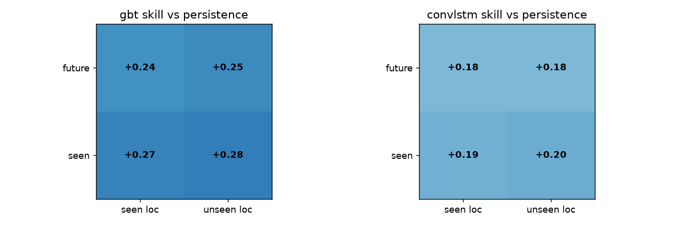
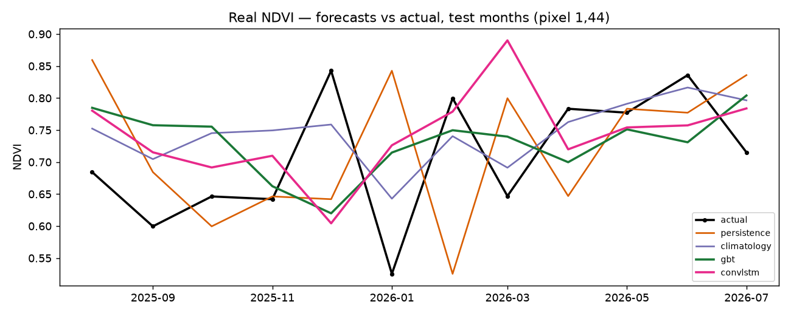

# Ecosystem State Forecaster

Forecasting next month's vegetation greenness (NDVI), one step ahead, from its
recent past and the seasonal cycle, across Australian biomes. Every model is
scored against persistence and seasonal-climatology baselines on splits that do
not leak in space or time.

Status: the v1 core runs end to end on Digital Earth Australia Sentinel-2
data for a Sunshine Coast hinterland area (130 monthly steps, 2015 to 2026, at
100 m). Gradient-boosted trees and a ConvLSTM both beat persistence by a clear
margin, but neither beats climatology, which is the expected result for NDVI
(see Results). Still to come: native 10 m resolution and the other three biomes.

## Problem

NDVI is strongly seasonal and strongly autocorrelated, so two simple baselines
are hard to beat:

- persistence: next month equals this month.
- seasonal climatology: next month equals the training-period average for that
  calendar month.

A model earns its place only by beating both, on data it has not seen. Most of
the work here goes into making that test fair rather than chasing a headline
accuracy number.

## Approach

The pipeline has four parts. It builds a monthly NDVI cube from cloud-masked
Sentinel-2. It derives features: short lags (t-1, t-2, t-3) for momentum, plus a
month-of-year encoding and a training-only climatology for seasonality. It fits
models of increasing complexity: the two baselines, gradient-boosted trees on a
per-pixel feature table, and a ConvLSTM that predicts the next frame as a
correction to the last one. It then evaluates with expanding-window walk-forward
folds and spatial blocks, and reports skill against the baselines.

## Data

| Layer | Source | Notes |
|-------|--------|-------|
| Imagery (v1) | DEA Sentinel-2 C3 (`ga_s2am_ard_3`, `ga_s2bm_ard_3`), 10 m | NBART surface reflectance; NDVI from red and NIR |
| Imagery (v2) | DEA Landsat C3, 30 m, from ~1986 | extends the record for interannual robustness |
| Rainfall, temperature | SILO (BoM gridded, ~5 km) | broadcast onto the NDVI grid |
| Soil moisture | ERA5-Land (~9 km) | |
| Fire | MODIS burned area | |
| Terrain | Copernicus GLO-30 DEM | elevation, slope, aspect |

## Method

### Features and baselines

The seasonal anomaly is NDVI minus its climatology, where the climatology is
computed on training data only. Using all years would leak the test period into
both the anomaly and the climatology baseline. The figure below shows the
construction on one synthetic pixel, with an injected drought as a run of
negative anomalies.


### Evaluation

Temporal splits use expanding-window walk-forward. Each fold tests a three-month
block and trains only on the months before it, with an embargo gap that drops
the most autocorrelated months so the test is not made artificially easy.


Spatial splits hold out blocks of pixels with a buffer ring between train and
test, so spatial autocorrelation does not cross the split.


Skill is reported in a 2x2 table of space against time, so it is clear where any
skill comes from. The headline cell is future time at seen locations, which
matches how the model would run in practice.

### Models

The gradient-boosted trees (LightGBM) work per pixel on the lag and season
features, retrained on each fold's training months and locations.

The ConvLSTM reads a short sequence of frames (cloud-filled NDVI, a validity
mask, month sin and cos, and any static layers) and predicts next month as a
correction to the most recent frame. The output head starts at zero, so the
model begins at persistence and learns the correction from there. It trains with
a loss masked to training months, training blocks, and valid pixels, and it uses
the GPU when one is available.


## Results

Real Sunshine Coast cube, headline cell (future time, seen locations):

| Model | RMSE | Skill vs persistence |
|-------|------|----------------------|
| persistence | 0.151 | reference |
| climatology | 0.109 | +28% |
| gradient-boosted trees | 0.110 | +24% |
| ConvLSTM | 0.120 | +18% |

The two models beat persistence by 18 to 28 percent. Neither beats climatology:
the gradient-boosted trees land level with it (0.110 against 0.109) and the
ConvLSTM sits about ten percent behind. For NDVI this is the honest outcome. The
seasonal cycle is so regular that climatology is very hard to beat one month
ahead, and matching it is already a real result. The value here is the
evaluation, not an inflated skill figure.



Skill against persistence stays positive in all four cells of the space-time
table, so the gain is not an artefact of one easy split.



The forecast trace is a single 100 m pixel and is noisy month to month; the
table is the reliable summary.

### Drivers

Lagged SILO rainfall was tested as an extra input and did not help. The
gradient-boosted trees went from 0.110 to 0.115 RMSE and the ConvLSTM was
unchanged, so recent NDVI already carries most of the vegetation's response to
recent weather at this monthly, 100 m, one-step-ahead setting. Rainfall stays in
the code as an optional input, off by default, and the driver machinery is ready
for soil moisture and fire.

## Repository layout

```
ecoforecast/
  config.yaml        # AOIs, dates, variables, split parameters
  data.py            # DEA STAC search + odc-stac load + NDVI + monthly composite
  features.py        # anomaly, lags, seasonal encoding, feature table
  baselines.py       # persistence + seasonal climatology
  evaluate.py        # walk-forward + spatial blocks + skill vs baselines
  models/
    gbt.py           # LightGBM, walk-forward
    convlstm.py      # scaled-back ConvLSTM (PyTorch, GPU-aware)
scripts/
  build_cube.py      # build + cache the real NDVI cube from DEA
  run_pipeline.py    # run all models on the cube, write real results
  demo_*.py          # synthetic-cube demos for each stage
tests/               # pytest suite
docs/figures/        # figures used in this README
```

## How to run

Create the virtual environment outside any cloud-synced folder. OneDrive and
Dropbox corrupt Python venvs and git repositories.

```bash
python -m venv .venv
# Windows: .\.venv\Scripts\Activate.ps1   |   macOS/Linux: source .venv/bin/activate
```

Install PyTorch for your hardware first, because the default wheel pulls a large
CUDA stack:

```bash
pip install torch --index-url https://download.pytorch.org/whl/cpu   # CPU
# NVIDIA GPU (Blackwell needs cu128+): pip install torch --index-url https://download.pytorch.org/whl/cu128
pip install -r requirements.txt
pip install -e .
```

Build the real cube (needs internet; set the area and dates in
`ecoforecast/config.yaml`), then run the models:

```bash
python scripts/build_cube.py
python scripts/run_pipeline.py
```

Every stage also has a demo that builds a small synthetic cube and writes its
figures, so you can run the whole thing offline:

```bash
python scripts/demo_baselines.py
python scripts/demo_evaluate.py
python scripts/demo_gbt.py
python scripts/demo_convlstm.py
pytest -q
```

## Evaluation notes

- Splits are honest in space and time; skill is always measured against the
  baselines on the same folds.
- Climatology is fit on training data only, per fold.
- The ConvLSTM is a convolutional model, so it still sees held-out blocks as
  input context even though the loss excludes them (a buffer separates them).
  Its unseen-location number is a softer test of spatial transfer than the
  per-pixel model's.
- Results are at 100 m for one area. Treat them as a working baseline, not a
  final answer.

## Roadmap

- Extend drivers: rainfall is wired in (SILO) but did not help; try soil moisture
  (ERA5-Land), fire (MODIS), and terrain from a DEM.
- Move from 100 m to native 10 m on the GPU.
- Extend to the other biomes: Daintree, Alice Springs, Kosciuszko.
- Later: a graph-based model, an ensemble with uncertainty, and a small
  interactive demo.

## Development

- Python 3.11; dependencies pinned in `requirements.txt`; the venv is not committed.
- Short-lived feature branches off `main`; `main` stays working.
- Small, focused commits with imperative messages; review the staged diff before
  committing; never commit data, model weights, secrets, or the venv.
