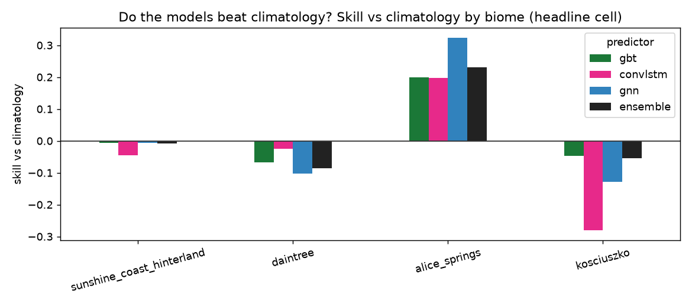
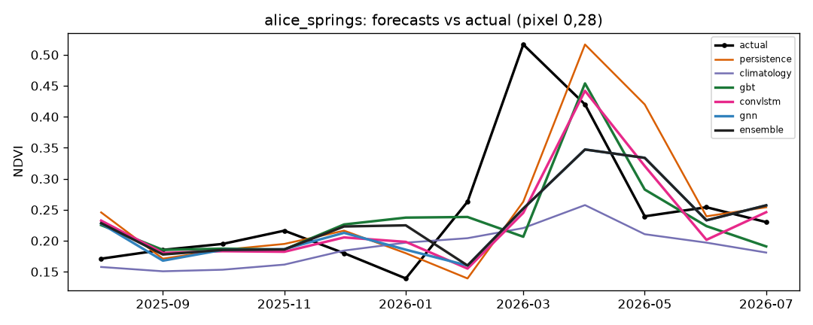

# Ecosystem State Forecaster


**[Try the interactive demo](https://ecosystem-state-forecaster.streamlit.app)**

Forecasting next month's vegetation greenness (NDVI), one step ahead, from its
recent past and the seasonal cycle, across Australian biomes. Every model is
scored against persistence and seasonal-climatology baselines on splits that do
not leak in space or time.

Status: the core runs end to end on Digital Earth Australia data across four
contrasting biomes (subtropical, tropical rainforest, arid, alpine) at 100 m,
with three models (gradient-boosted trees, a ConvLSTM, and a GraphCast-style GNN)
plus a stacked ensemble. On the 11-year Sentinel-2 record the models beat
persistence everywhere but only beat climatology in arid Alice Springs. On the
40-year Landsat record they beat climatology in every biome (see Results).
Native 10 m was tested on a 4 km box and did not improve on 100 m.

## Problem

NDVI is strongly seasonal and strongly autocorrelated, so two simple baselines
are hard to beat:

- persistence: next month equals this month.
- seasonal climatology: next month equals the training-period average for that
  calendar month.

A model earns its place only by beating both, on data it has not seen. Most of
the work here goes into making that test fair rather than chasing a headline
accuracy number.

## Approach

The pipeline has four parts. It builds a monthly NDVI cube from cloud-masked
Sentinel-2. It derives features: short lags (t-1, t-2, t-3) for momentum, plus a
month-of-year encoding and a training-only climatology for seasonality. It fits
models of increasing complexity: the two baselines, gradient-boosted trees on a
per-pixel feature table, a ConvLSTM that predicts the next frame as a correction
to the last one, and a graph network that passes information between neighbouring
pixels. It then evaluates with expanding-window walk-forward
folds and spatial blocks, and reports skill against the baselines.

## Data

| Layer | Source | Notes |
|-------|--------|-------|
| Imagery (v1) | DEA Sentinel-2 C3 (`ga_s2am_ard_3`, `ga_s2bm_ard_3`), 10 m | NBART surface reflectance; NDVI from red and NIR |
| Imagery (v2) | DEA Landsat C3, 30 m, from ~1986 | extends the record for interannual robustness |
| Rainfall, temperature | SILO (BoM gridded, ~5 km) | broadcast onto the NDVI grid |
| Soil moisture | ERA5-Land (~9 km) | |
| Fire | MODIS burned area | |
| Terrain | Copernicus GLO-30 DEM | elevation, slope, aspect |

## Method

### Features and baselines

The seasonal anomaly is NDVI minus its climatology, where the climatology is
computed on training data only. Using all years would leak the test period into
both the anomaly and the climatology baseline. The figure below shows the
construction on one synthetic pixel, with an injected drought as a run of
negative anomalies.


### Evaluation

Temporal splits use expanding-window walk-forward. Each fold tests a three-month
block and trains only on the months before it, with an embargo gap that drops
the most autocorrelated months so the test is not made artificially easy.


Spatial splits hold out blocks of pixels with a buffer ring between train and
test, so spatial autocorrelation does not cross the split.


Skill is reported in a 2x2 table of space against time, so it is clear where any
skill comes from. The headline cell is future time at seen locations, which
matches how the model would run in practice.

### Models

The gradient-boosted trees (LightGBM) work per pixel on the lag and season
features, retrained on each fold's training months and locations.

The ConvLSTM reads a short sequence of frames (cloud-filled NDVI, a validity
mask, month sin and cos, and any static layers) and predicts next month as a
correction to the most recent frame. The output head starts at zero, so the
model begins at persistence and learns the correction from there. It trains with
a loss masked to training months, training blocks, and valid pixels, and it uses
the GPU when one is available.


The GNN follows a GraphCast-style encode-process-decode shape. Each pixel is a
node joined to its four grid neighbours; an encoder embeds the same per-pixel
features, several rounds of message passing let neighbours share information, and
a residual decoder predicts next month. Like the ConvLSTM it starts at
persistence and trains on the GPU.

## Results

Headline cell (future time, seen locations), RMSE across four biomes:

| Biome | persistence | climatology | GBT | ConvLSTM | GNN | ensemble |
|-------|-------------|-------------|-----|----------|-----|----------|
| Sunshine Coast (subtropical) | 0.151 | 0.109 | 0.110 | 0.114 | 0.110 | 0.111 |
| Daintree (tropical rainforest) | 0.250 | 0.168 | 0.184 | 0.173 | 0.188 | 0.186 |
| Alice Springs (arid) | 0.071 | 0.087 | 0.069 | 0.066 | 0.063 | 0.067 |
| Kosciuszko (alpine) | 0.121 | 0.078 | 0.083 | 0.100 | 0.090 | 0.084 |

What matters is where each method wins. In the three strongly seasonal biomes
(subtropical, rainforest, alpine) climatology is very hard to beat: the models
match it but do not pass it, because the seasonal cycle already explains most of
next month's greenness.

Arid Alice Springs is the exception, and the interesting one. There the seasonal
cycle is weak, so climatology is worse than persistence: desert vegetation
responds to episodic rain, not the calendar. All three models beat climatology,
because recent NDVI carries the signal of a rain pulse that a monthly average
cannot. The GNN wins by the widest margin (0.063 against climatology's 0.087),
which fits: desert rain falls in spatially coherent bands, so letting neighbouring
pixels share information through the graph pays off exactly where it should.



The arid green-up makes the point. Climatology stays flat while the models track
the pulse from recent momentum:



So forecastability is not uniform across the continent. It depends on how
seasonal the vegetation is, and the honest evaluation surfaces that instead of
hiding it in one averaged number.

### Drivers

Lagged SILO rainfall was tested as an extra input and did not help. The
gradient-boosted trees went from 0.110 to 0.115 RMSE and the ConvLSTM was
unchanged, so recent NDVI already carries most of the vegetation's response to
recent weather at this monthly, 100 m, one-step-ahead setting. Rainfall stays in
the code as an optional input, off by default, and the driver machinery is ready
for soil moisture and fire.

### Ensemble

Stacking the three models with rolling-calibrated convex weights gives a robust
blend: it is bounded by its members, never worse than the worst, and competitive
in every biome. But it does not beat the best single model anywhere. Averaging
dilutes the biome-specific winner, clearest in arid Alice Springs where the GNN
alone is strongest. Like the rainfall drivers, a reasonable idea that did not add
skill on this record, though it removes the need to pick a model per biome. On
the longer Landsat record below it does noticeably better.

### The longer record

Rebuilding on Landsat (1988 to 2026, 463 months, same 100 m grid) changes the
conclusion. Headline RMSE:

| Biome | persistence | climatology | GBT | ConvLSTM | GNN | ensemble |
|-------|-------------|-------------|-----|----------|-----|----------|
| Sunshine Coast (subtropical) | 0.085 | 0.088 | 0.067 | 0.075 | 0.080 | 0.067 |
| Daintree (tropical rainforest) | 0.099 | 0.102 | 0.081 | 0.106 | 0.097 | 0.083 |
| Alice Springs (arid) | 0.068 | 0.096 | 0.064 | 0.060 | 0.068 | 0.060 |
| Kosciuszko (alpine) | 0.131 | 0.097 | 0.095 | 0.124 | 0.103 | 0.094 |

With four decades instead of one, the gradient-boosted trees and the ensemble
beat climatology in every biome, not just the arid one. Two things drive that.
The models get about 3.5 times more training data. And climatology itself
weakens: over forty years a typical month has to absorb far more interannual
variability, and in the Sunshine Coast and Daintree it is now worse even than
persistence. The short record flattered climatology.

The ensemble earns its keep here too, finishing first or equal first in three of
the four biomes, because the extra folds give the stacking weights more to
calibrate on.

Absolute errors are not comparable between the two records, since Sentinel-2 and
Landsat are different instruments with different compositing. The honest
comparison is each model against its own baselines within each record.


### Resolution

Native 10 m does not fit the main areas. The Sunshine Coast box is 150 by 120
pixels at 100 m. At 10 m it is 1500 by 1200, which is 234 million pixel-months.
The gradient-boosted trees build one feature table across the whole cube before
subsampling, and predict over every row of it, so that run needs roughly 22 GB of
memory. Capping the training rows does not avoid it.

So the resolution question is asked on a smaller area instead.
`sunshine_coast_core` is a 4 by 4 km box nested inside the Sunshine Coast AOI,
built at both 100 m and 10 m over the same months. Only the resolution differs.

One thing had to be fixed first. Spatial blocks were specified in pixels, so a 20
pixel block meant 2 km at 100 m but 200 m at 10 m. The finer split would have put
held-out blocks well inside the range over which NDVI is autocorrelated, leaked
across the split, and flattered the 10 m arm for the wrong reason. Blocks and
buffers are now given in metres and converted per cube. At 100 m they resolve to
exactly the 20 pixel block and 2 pixel buffer behind every result above, checked
against the cached cubes so the published numbers are unaffected.

A 4 km box cannot hold enough 2 km blocks, so both arms of this comparison use
500 m blocks with a 100 m buffer. That makes its numbers internal to the
comparison and not comparable with the headline table.

Headline cell, each model against the baselines of its own arm:

| Model | 100 m RMSE | skill vs climatology | 10 m RMSE | skill vs climatology |
|-------|------------|----------------------|-----------|----------------------|
| GBT | 0.1098 | +0.3% | 0.1150 | +0.2% |
| ConvLSTM | 0.1193 | -8.3% | 0.1125 | +2.4% |
| GNN | 0.1053 | +4.4% | 0.1135 | +1.5% |
| ensemble | 0.1053 | +4.4% | 0.1097 | +4.8% |

Four decimals here because the differences are smaller than the three used
elsewhere would show. Baselines: climatology 0.1101 at 100 m against 0.1152 at
10 m, persistence 0.1550 against 0.1577.

Native resolution does not help. Every predictor has a higher absolute error at
10 m, the two baselines included, which is what you would expect when each pixel
covers a hundredth of the ground and carries proportionally more sensor noise and
cloud-edge contamination. Absolute errors are therefore not the thing to compare;
skill against each arm's own baselines is. On that measure the models are flat or
slightly worse at 10 m. The GNN gives up most of its advantage and the
gradient-boosted trees do not move.

The exception is the ConvLSTM, and it is the one that makes sense. It is the only
model here whose inductive bias is spatial, and it is the only one that improves,
from worse than climatology at 100 m to slightly better at 10 m. Finer pixels
give its convolutions real spatial structure to work with instead of a field that
has already been averaged smooth. On a single 4 km box that is a suggestion worth
following up, not a result.

Two caveats. A failed scene search cost the 100 m cube November and December
2024. Both months fall in the training period rather than the test window, so
both arms are scored on identical months, and the loss handicaps the 100 m arm,
which is the arm that did better. The two grids also differ slightly in extent,
4.70 by 4.70 km against 4.64 by 4.54 km, because the bounding box is reprojected
before being snapped to each resolution.

## Repository layout

```
ecoforecast/
  config.yaml        # biomes, dates, variables, split parameters
  data.py            # DEA STAC search + odc-stac load + NDVI + monthly composite
  features.py        # anomaly, lags, seasonal encoding, feature table
  baselines.py       # persistence + seasonal climatology
  evaluate.py        # walk-forward + spatial blocks + skill vs baselines
  drivers.py         # SILO rainfall, aligned and lagged onto the grid
  uncertainty.py     # conformal prediction intervals
  ensemble.py        # rolling-calibrated convex stack of the models
  app_data.py        # precompute the small artifacts the demo reads
  models/
    gbt.py           # LightGBM, walk-forward
    convlstm.py      # scaled-back ConvLSTM (PyTorch, GPU-aware)
    gnn.py           # GraphCast-style message-passing GNN
scripts/
  build_cube.py      # build + cache one NDVI cube per biome from DEA
  run_pipeline.py    # evaluate every biome, write per-biome + cross-biome results
  demo_*.py          # synthetic-cube demos for each stage
app/streamlit_app.py # interactive demo, reads only the precomputed artifacts
tests/               # pytest suite
docs/figures/        # figures used in this README
docs/app_data/       # small NetCDF artifacts that power the demo
```

## How to run

Create the virtual environment outside any cloud-synced folder. OneDrive and
Dropbox corrupt Python venvs and git repositories.

```bash
python -m venv .venv
# Windows: .\.venv\Scripts\Activate.ps1   |   macOS/Linux: source .venv/bin/activate
```

Install PyTorch for your hardware first, because the default wheel pulls a large
CUDA stack:

```bash
pip install torch --index-url https://download.pytorch.org/whl/cpu   # CPU
# NVIDIA GPU (Blackwell needs cu128+): pip install torch --index-url https://download.pytorch.org/whl/cu128
pip install -r requirements-dev.txt
pip install -e .
```

There are two dependency files. `requirements-dev.txt` is the full research
stack above. `requirements.txt` is deliberately slim: it holds only what the
hosted demo needs, because the demo reads precomputed files and imports no model
or geospatial libraries.

Build the real cube (needs internet; set the area and dates in
`ecoforecast/config.yaml`), then run the models:

```bash
python scripts/build_cube.py
python scripts/run_pipeline.py
```

Every stage also has a demo that builds a small synthetic cube and writes its
figures, so you can run the whole thing offline:

```bash
python scripts/demo_baselines.py
python scripts/demo_evaluate.py
python scripts/demo_gbt.py
python scripts/demo_convlstm.py
python scripts/demo_gnn.py
python scripts/demo_uncertainty.py
pytest -q
```

## Interactive demo

`scripts/run_pipeline.py` writes a small artifact per biome per record into
`docs/app_data/`: a coarsened NDVI window, the month-of-year climatology, each
model's out-of-sample forecasts, the training mask, the headline scores, and a
table of conformal quantiles. The app reads those and nothing else, so it trains
nothing on load, imports no model libraries, and fits in a free hosting tier.
The whole set is about 15 MB.

Storing the quantile table rather than one fixed interval is what keeps the
confidence slider live: moving it looks up a different quantile instead of
recomputing anything.

The control worth trying first is the satellite record. Switching between the
11-year Sentinel-2 and the 40-year Landsat record flips the headline result,
from climatology winning nearly everywhere to the models winning in every biome.
You can also pick a biome and a model, step through forecast months against the
actual and error maps, follow one pixel through time against both baselines, and
check that the interval's observed coverage matches the level you asked for.

```bash
streamlit run app/streamlit_app.py
```

The hosted copy runs on Streamlit Community Cloud, pointed at this repository
with `app/streamlit_app.py` as the entry point. It installs from the slim
`requirements.txt`, and `docs/app_data/` is committed, so nothing is built on the
server and a push to `main` redeploys it.

## Evaluation notes

- Splits do not leak in space or time; skill is always measured against the
  baselines on the same folds.
- Climatology is fit on training data only, per fold.
- The ConvLSTM is a convolutional model, so it still sees held-out blocks as
  input context even though the loss excludes them (a buffer separates them).
  Its unseen-location number is a softer test of spatial transfer than the
  per-pixel model's.
- Results are at 100 m for four areas. Treat them as a working baseline, not a
  final answer.

## Roadmap

- Extend drivers: rainfall is wired in (SILO) but did not help; try soil moisture
  (ERA5-Land), fire (MODIS), and terrain from a DEM.
- Follow up the one 10 m result that moved: the ConvLSTM improved at native
  resolution while everything else did not. Worth testing on a second area before
  reading anything into it.
- Chunk the gradient-boosted-trees feature table so native resolution can run on
  a full-sized area, and train the ConvLSTM on patches rather than whole frames,
  which is what stands between this and 10 m at scale.

## Development

- Python 3.11; dependencies pinned in `requirements.txt` (demo) and
  `requirements-dev.txt` (full pipeline); the venv is not committed.
- Short-lived feature branches off `main`; `main` stays working.
- Small, focused commits with imperative messages; review the staged diff before
  committing; never commit data, model weights, secrets, or the venv.
