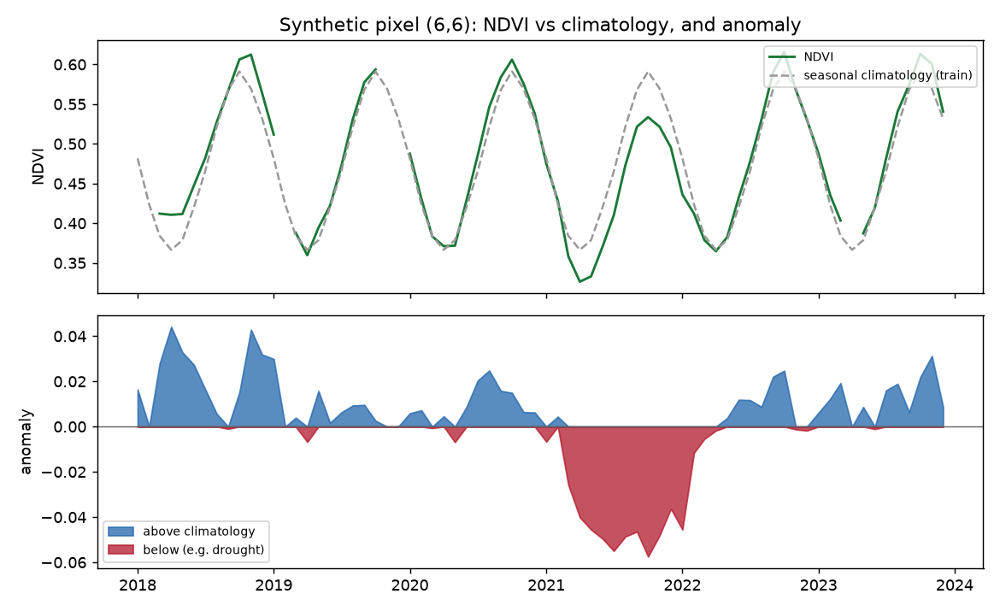
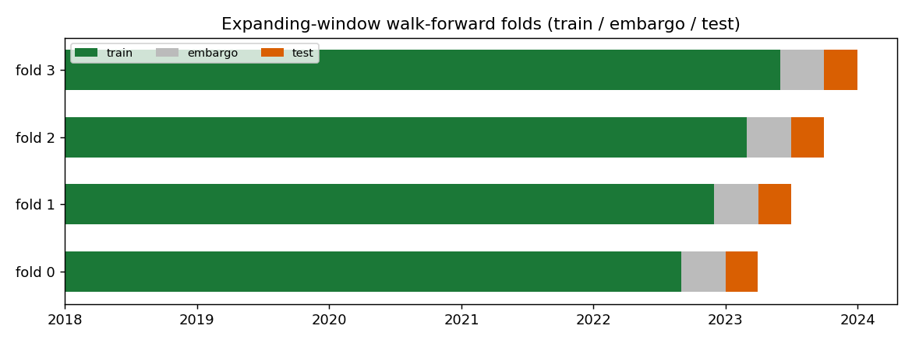
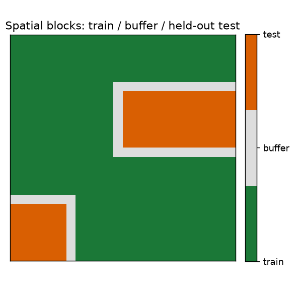
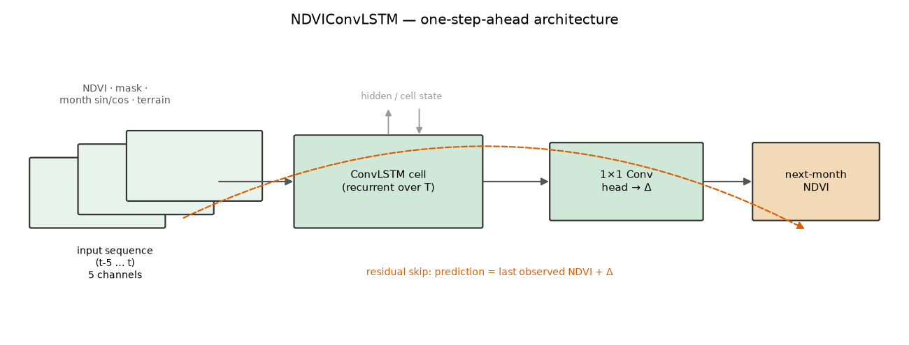
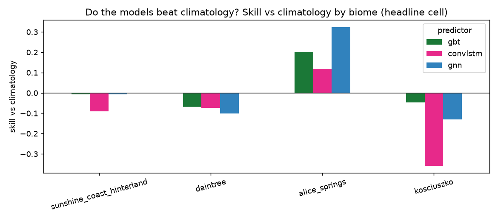
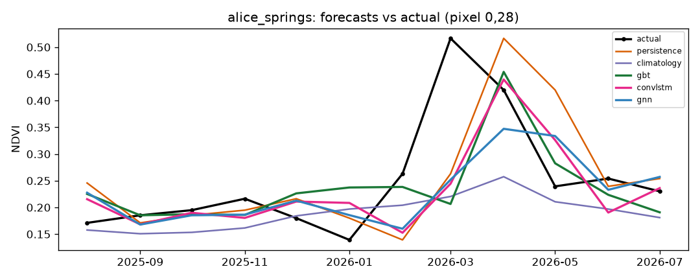
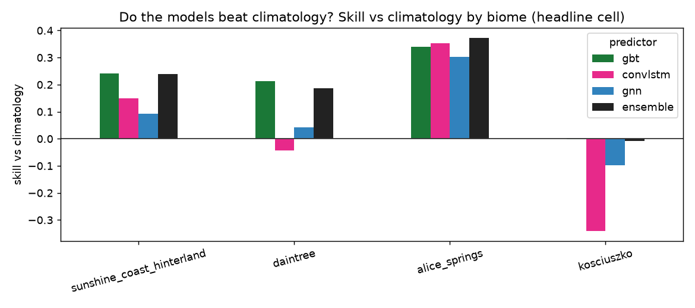

# Ecosystem State Forecaster


Forecasting next month's vegetation greenness (NDVI), one step ahead, from its
recent past and the seasonal cycle, across Australian biomes. Every model is
scored against persistence and seasonal-climatology baselines on splits that do
not leak in space or time.

Status: the core runs end to end on Digital Earth Australia data across four
contrasting biomes (subtropical, tropical rainforest, arid, alpine) at 100 m,
with three models (gradient-boosted trees, a ConvLSTM, and a GraphCast-style GNN)
plus a stacked ensemble. On the 11-year Sentinel-2 record the models beat
persistence everywhere but only beat climatology in arid Alice Springs. On the
40-year Landsat record they beat climatology in every biome (see Results). Still
to come: native 10 m resolution.

## Problem

NDVI is strongly seasonal and strongly autocorrelated, so two simple baselines
are hard to beat:

- persistence: next month equals this month.
- seasonal climatology: next month equals the training-period average for that
  calendar month.

A model earns its place only by beating both, on data it has not seen. Most of
the work here goes into making that test fair rather than chasing a headline
accuracy number.

## Approach

The pipeline has four parts. It builds a monthly NDVI cube from cloud-masked
Sentinel-2. It derives features: short lags (t-1, t-2, t-3) for momentum, plus a
month-of-year encoding and a training-only climatology for seasonality. It fits
models of increasing complexity: the two baselines, gradient-boosted trees on a
per-pixel feature table, a ConvLSTM that predicts the next frame as a correction
to the last one, and a graph network that passes information between neighbouring
pixels. It then evaluates with expanding-window walk-forward
folds and spatial blocks, and reports skill against the baselines.

## Data

| Layer | Source | Notes |
|-------|--------|-------|
| Imagery (v1) | DEA Sentinel-2 C3 (`ga_s2am_ard_3`, `ga_s2bm_ard_3`), 10 m | NBART surface reflectance; NDVI from red and NIR |
| Imagery (v2) | DEA Landsat C3, 30 m, from ~1986 | extends the record for interannual robustness |
| Rainfall, temperature | SILO (BoM gridded, ~5 km) | broadcast onto the NDVI grid |
| Soil moisture | ERA5-Land (~9 km) | |
| Fire | MODIS burned area | |
| Terrain | Copernicus GLO-30 DEM | elevation, slope, aspect |

## Method

### Features and baselines

The seasonal anomaly is NDVI minus its climatology, where the climatology is
computed on training data only. Using all years would leak the test period into
both the anomaly and the climatology baseline. The figure below shows the
construction on one synthetic pixel, with an injected drought as a run of
negative anomalies.



### Evaluation

Temporal splits use expanding-window walk-forward. Each fold tests a three-month
block and trains only on the months before it, with an embargo gap that drops
the most autocorrelated months so the test is not made artificially easy.



Spatial splits hold out blocks of pixels with a buffer ring between train and
test, so spatial autocorrelation does not cross the split.



Skill is reported in a 2x2 table of space against time, so it is clear where any
skill comes from. The headline cell is future time at seen locations, which
matches how the model would run in practice.

### Models

The gradient-boosted trees (LightGBM) work per pixel on the lag and season
features, retrained on each fold's training months and locations.

The ConvLSTM reads a short sequence of frames (cloud-filled NDVI, a validity
mask, month sin and cos, and any static layers) and predicts next month as a
correction to the most recent frame. The output head starts at zero, so the
model begins at persistence and learns the correction from there. It trains with
a loss masked to training months, training blocks, and valid pixels, and it uses
the GPU when one is available.



The GNN follows a GraphCast-style encode-process-decode shape. Each pixel is a
node joined to its four grid neighbours; an encoder embeds the same per-pixel
features, several rounds of message passing let neighbours share information, and
a residual decoder predicts next month. Like the ConvLSTM it starts at
persistence and trains on the GPU.

## Results

Headline cell (future time, seen locations), RMSE across four biomes:

| Biome | persistence | climatology | GBT | ConvLSTM | GNN | ensemble |
|-------|-------------|-------------|-----|----------|-----|----------|
| Sunshine Coast (subtropical) | 0.151 | 0.109 | 0.110 | 0.120 | 0.110 | 0.111 |
| Daintree (tropical rainforest) | 0.250 | 0.168 | 0.184 | 0.179 | 0.191 | 0.189 |
| Alice Springs (arid) | 0.071 | 0.087 | 0.069 | 0.069 | 0.064 | 0.071 |
| Kosciuszko (alpine) | 0.122 | 0.078 | 0.083 | 0.106 | 0.090 | 0.084 |

What matters is where each method wins. In the three strongly seasonal biomes
(subtropical, rainforest, alpine) climatology is very hard to beat: the models
match it but do not pass it, because the seasonal cycle already explains most of
next month's greenness.

Arid Alice Springs is the exception, and the interesting one. There the seasonal
cycle is weak, so climatology is worse than persistence: desert vegetation
responds to episodic rain, not the calendar. All three models beat climatology,
because recent NDVI carries the signal of a rain pulse that a monthly average
cannot. The GNN wins by the widest margin (0.064 against climatology's 0.087),
which fits: desert rain falls in spatially coherent bands, so letting neighbouring
pixels share information through the graph pays off exactly where it should.



The arid green-up makes the point. Climatology stays flat while the models track
the pulse from recent momentum:



So forecastability is not uniform across the continent. It depends on how
seasonal the vegetation is, and the honest evaluation surfaces that instead of
hiding it in one averaged number.

### Drivers

Lagged SILO rainfall was tested as an extra input and did not help. The
gradient-boosted trees went from 0.110 to 0.115 RMSE and the ConvLSTM was
unchanged, so recent NDVI already carries most of the vegetation's response to
recent weather at this monthly, 100 m, one-step-ahead setting. Rainfall stays in
the code as an optional input, off by default, and the driver machinery is ready
for soil moisture and fire.

### Ensemble

Stacking the three models with rolling-calibrated convex weights gives a robust
blend: it is bounded by its members, never worse than the worst, and competitive
in every biome. But it does not beat the best single model anywhere. Averaging
dilutes the biome-specific winner, clearest in arid Alice Springs where the GNN
alone is strongest. Like the rainfall drivers, a reasonable idea that did not add
skill on this record, though it removes the need to pick a model per biome. On
the longer Landsat record below it does noticeably better.

### The longer record

Rebuilding on Landsat (1988 to 2026, 463 months, same 100 m grid) changes the
conclusion. Headline RMSE:

| Biome | persistence | climatology | GBT | ConvLSTM | GNN | ensemble |
|-------|-------------|-------------|-----|----------|-----|----------|
| Sunshine Coast (subtropical) | 0.085 | 0.088 | 0.067 | 0.075 | 0.080 | 0.067 |
| Daintree (tropical rainforest) | 0.099 | 0.102 | 0.081 | 0.106 | 0.097 | 0.083 |
| Alice Springs (arid) | 0.068 | 0.096 | 0.064 | 0.060 | 0.068 | 0.060 |
| Kosciuszko (alpine) | 0.131 | 0.097 | 0.095 | 0.124 | 0.103 | 0.094 |

With four decades instead of one, the gradient-boosted trees and the ensemble
beat climatology in every biome, not just the arid one. Two things drive that.
The models get about 3.5 times more training data. And climatology itself
weakens: over forty years a typical month has to absorb far more interannual
variability, and in the Sunshine Coast and Daintree it is now worse even than
persistence. The short record flattered climatology.

The ensemble earns its keep here too, finishing first or equal first in three of
the four biomes, because the extra folds give the stacking weights more to
calibrate on.

Absolute errors are not comparable between the two records, since Sentinel-2 and
Landsat are different instruments with different compositing. The honest
comparison is each model against its own baselines within each record.



## Repository layout

```
ecoforecast/
  config.yaml        # biomes, dates, variables, split parameters
  data.py            # DEA STAC search + odc-stac load + NDVI + monthly composite
  features.py        # anomaly, lags, seasonal encoding, feature table
  baselines.py       # persistence + seasonal climatology
  evaluate.py        # walk-forward + spatial blocks + skill vs baselines
  drivers.py         # SILO rainfall, aligned and lagged onto the grid
  uncertainty.py     # conformal prediction intervals
  models/
    gbt.py           # LightGBM, walk-forward
    convlstm.py      # scaled-back ConvLSTM (PyTorch, GPU-aware)
    gnn.py           # GraphCast-style message-passing GNN
scripts/
  build_cube.py      # build + cache one NDVI cube per biome from DEA
  run_pipeline.py    # evaluate every biome, write per-biome + cross-biome results
  demo_*.py          # synthetic-cube demos for each stage
app/streamlit_app.py # interactive demo: pick a biome, see the forecast
tests/               # pytest suite
docs/figures/        # figures used in this README
```

## How to run

Create the virtual environment outside any cloud-synced folder. OneDrive and
Dropbox corrupt Python venvs and git repositories.

```bash
python -m venv .venv
# Windows: .\.venv\Scripts\Activate.ps1   |   macOS/Linux: source .venv/bin/activate
```

Install PyTorch for your hardware first, because the default wheel pulls a large
CUDA stack:

```bash
pip install torch --index-url https://download.pytorch.org/whl/cpu   # CPU
# NVIDIA GPU (Blackwell needs cu128+): pip install torch --index-url https://download.pytorch.org/whl/cu128
pip install -r requirements.txt
pip install -e .
```

Build the real cube (needs internet; set the area and dates in
`ecoforecast/config.yaml`), then run the models:

```bash
python scripts/build_cube.py
python scripts/run_pipeline.py
```

Every stage also has a demo that builds a small synthetic cube and writes its
figures, so you can run the whole thing offline:

```bash
python scripts/demo_baselines.py
python scripts/demo_evaluate.py
python scripts/demo_gbt.py
python scripts/demo_convlstm.py
python scripts/demo_gnn.py
python scripts/demo_uncertainty.py
pytest -q
```

Launch the interactive demo (pick a biome, see the forecast and its uncertainty
band on a map):

```bash
streamlit run app/streamlit_app.py
```

## Evaluation notes

- Splits are honest in space and time; skill is always measured against the
  baselines on the same folds.
- Climatology is fit on training data only, per fold.
- The ConvLSTM is a convolutional model, so it still sees held-out blocks as
  input context even though the loss excludes them (a buffer separates them).
  Its unseen-location number is a softer test of spatial transfer than the
  per-pixel model's.
- Results are at 100 m for four areas. Treat them as a working baseline, not a
  final answer.

## Roadmap

- Extend drivers: rainfall is wired in (SILO) but did not help; try soil moisture
  (ERA5-Land), fire (MODIS), and terrain from a DEM.
- Run at native 10 m on one AOI (a config profile) to see whether field-scale
  detail changes the picture.

## Development

- Python 3.11; dependencies pinned in `requirements.txt`; the venv is not committed.
- Short-lived feature branches off `main`; `main` stays working.
- Small, focused commits with imperative messages; review the staged diff before
  committing; never commit data, model weights, secrets, or the venv.
